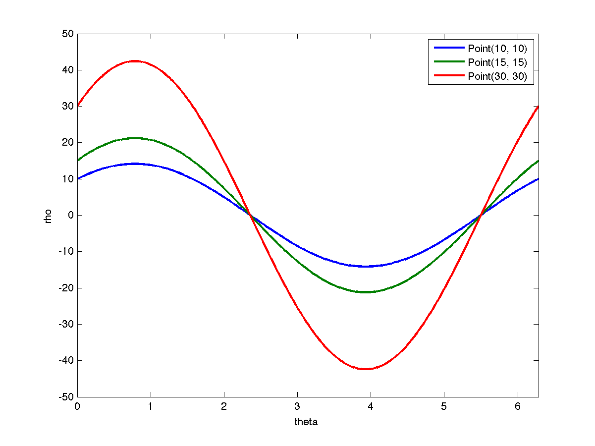

#		16720-A S18 Hough Transform

##		Instructor: Kris Kitani

####	TAs: Leonid Keselman, Mohit Sharma, Arjun Sharma, Rawal Khirodkar, Aashi Manglik, Tanya Marwah

#####	Due Feb 8, 2018 11:59 PM

Total Points: 100 Extra Credit Points: 20

##	2 Theory Questions

###	Q2.1

-	Show that if you use the line equation $xcos\theta + ysin\theta − \rho = 0$, each image point $(x, y)$ results in a sinusoid in $(\rho, \theta)$ Hough space. Relate the amplitude and phase of the sinusoid to the point $(x, y)$.

-	Ans

	For each point $(x_i, y_i)$ on line $xcos\theta + ysin\theta − \rho = 0$, set $\rho_i=\sqrt{x_i^2+y_i^2}$, $tan\theta_i=y_i/x_i$
	
	The result of sinusoid in $(\rho, \theta)$ Hough space:
	
	$$\rho = \rho_i cos(\theta - \theta_i) = xcos\theta_i+ysin\theta_i$$
	
	$amplitude = \rho_i$
	
	$phase = \theta_i$
	
###	Q2.2

-	Why do we parameterize the line in terms of $\rho, \theta$ instead of slope and intercept $(m, c)$? Express the slope and intercept in terms of ρ and θ.

-	Ans

	Easy for calculation
	
	$Slope = tan\theta$
	
	$Intercept = \rho / sin\theta$
	
###	Q2.3

-	Assuming that the image points $(x, y)$ are in an image of width $W$ and height $H$ (i.e., $x \in [1, W]$, $y \in [1, H]$), what is the maximum absolute value of $ρ$ and what is the range of $θ$?

-	Ans

	$\rho_{max} = \sqrt{W@Q^2+H^2}$
	
	$\theta \in [0, \pi/2]$
	
###	Q2.4

-	Forpoints$(10,10)$, $(15,15)$ and $(30,30)$in the image, plot the corresponding sinusoid waves in Hough space $(ρ, θ)$ and visualize how their intersection point defines the line (what is $(m, c)$ for this line?). Please use MATLAB to plot the curves and report the result in your write-up.

-	Ans

	Matlab file saved as ***'../matlab/Q2_4.m'***
	
	Plot saved as ***'./Q2_4.png'***
	
	

	
	

	
###	Q2.5(extra)

-	How does the dimension of parameter space affects Hough Transform method? What would you do when the parameter space is high? Briefly explain your method in the write-up.

##	3 Implementation

	
	