#		16720-A S18 Bag of Visual Words

##		Instructor: Kris Kitani

####	TAs: Leonid Keselman, Mohit Sharma, Arjun Sharma, Rawal Khirodkar, Aashi Manglik, Tanya Marwah

#####	Due Feb 22, 2018 11:59 PM

Total Points: 100 Extra Credit Points: 30

##		Part 1 Build Visual Words Dictionary

###		Q1.1

-	What properties do each of the filter functions pick up?

-	Ans

	Gaussian: Reduce noise and spurious fine edges in the image.
	
	Log: Gradient extraction
	
	dxScale: edge filter in x direction
	
	dyScale: edge filter in y direction

###		Q1.2

-	 Show an image from the dataset and 3 of its filter responses. Explain any artifacts you may notice. Also briefly describe the CIE Lab colorspace, and why we would like to use it.

-	Ans

	The Lab color space describes mathematically all perceivable colors in the three dimensions L for lightness and a and b for the color components green–red and blue–yellow.

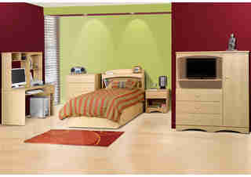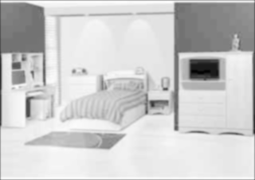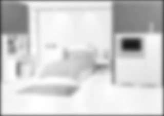

###		Q1.3

-	Show the results of your corner detector on 3 different images.

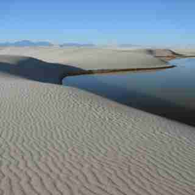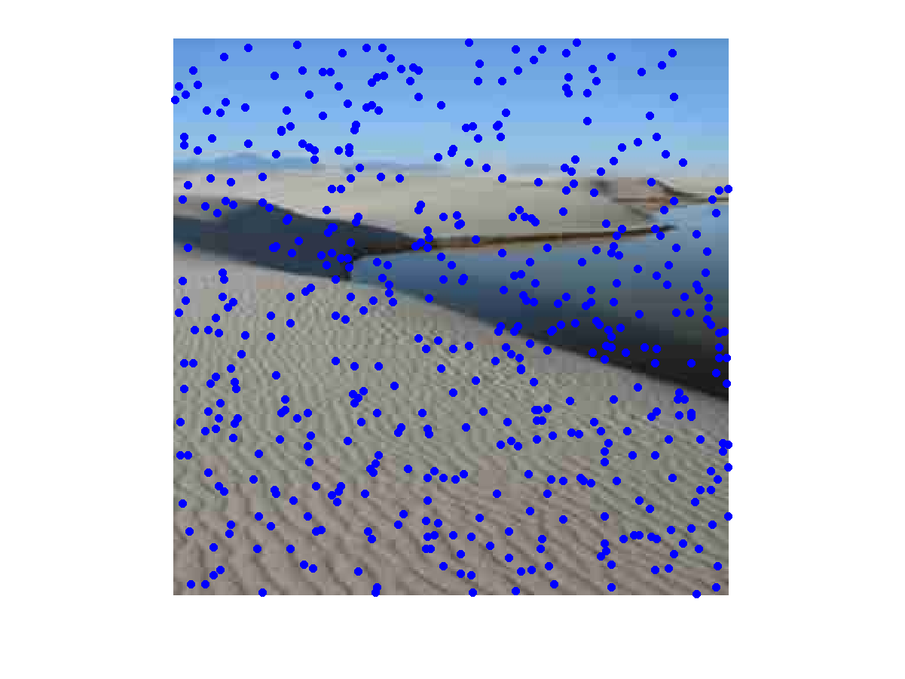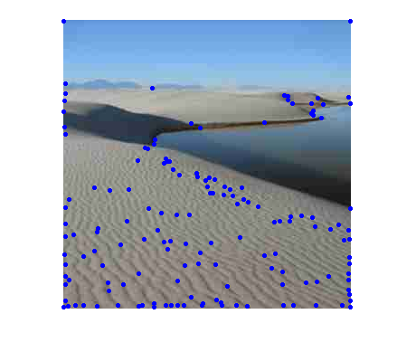

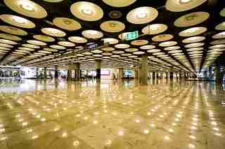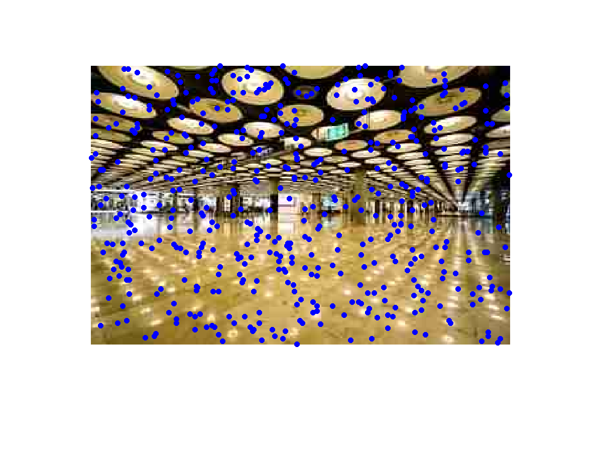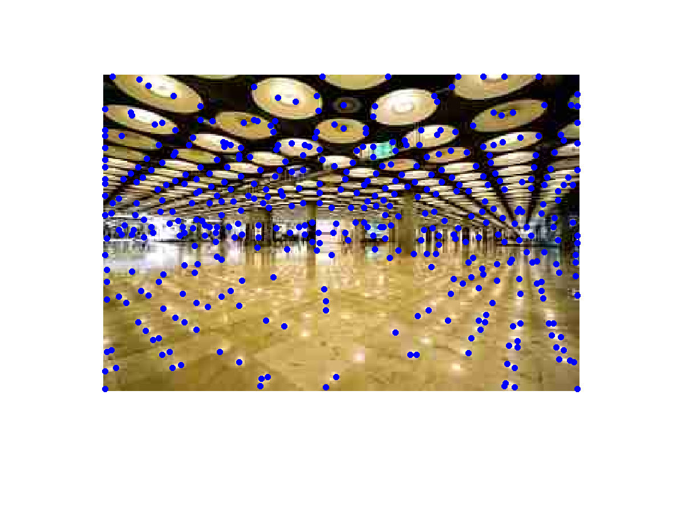

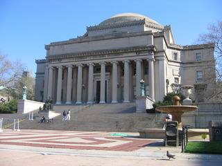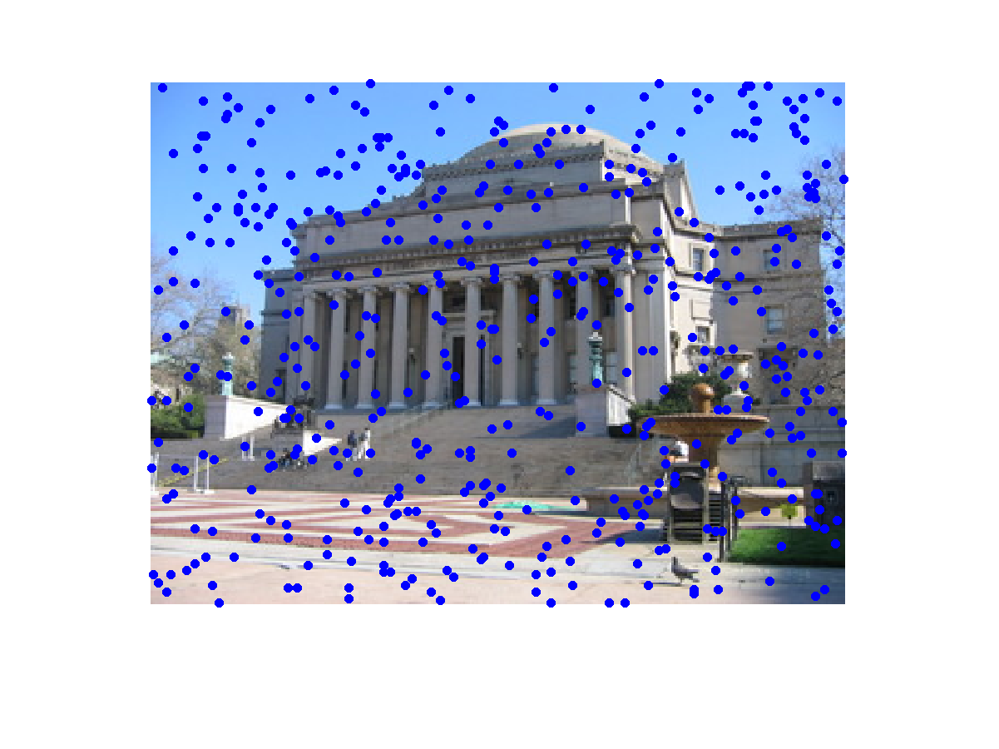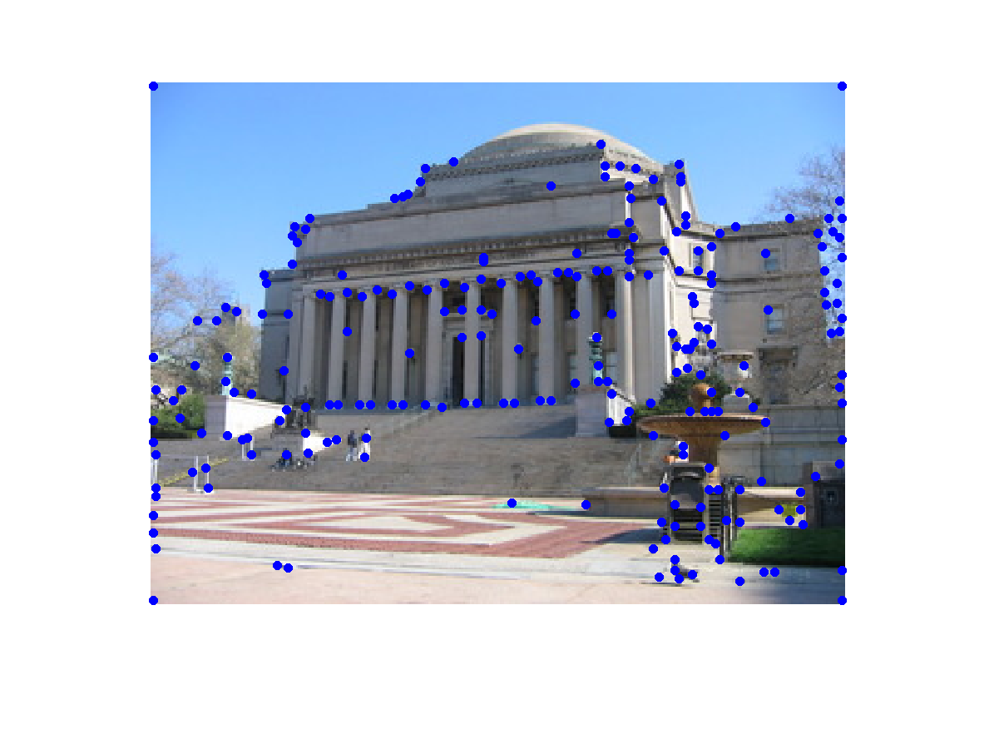

##		Part 2 Build Recognition System

###		Q2.1

##		Part 3 Evaluate Recognition System

###		Q3.1

###		Q3.2

##		X Extra Credit

###		QX.1

###		QX.2

###		QX.3